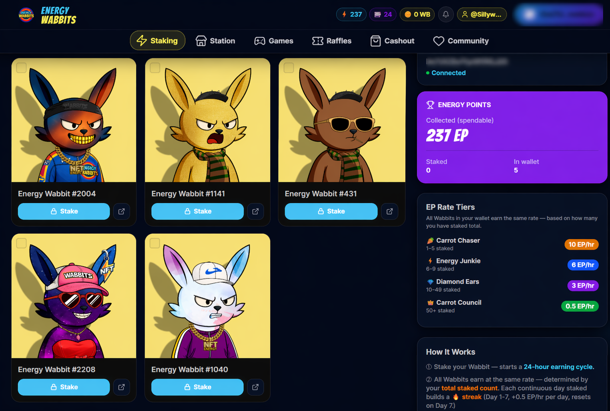
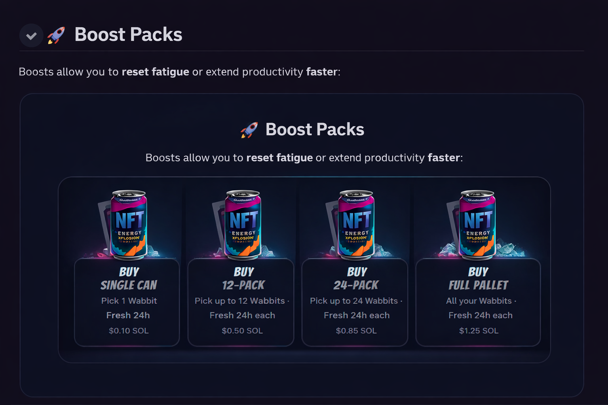

# 🐰⚡ Energy Wabbits — Staking Mechanics

## Overview

Energy Wabbits uses a **gamified Work Cycle system**.

Players stake their Wabbit NFTs to earn **Energy Points (EP)** off-chain, which can later convert into **Wabbit Bucks (WB)** — the main in-game currency.

WB is used throughout the ecosystem for **games, raffles, and reward-based activities**.

---

## 🧠 Staking

- Players stake Wabbits through the staking system  
- A Work Cycle begins immediately  

### Key Features:

- Batch staking supported (up to 100 NFTs)  
- Unstaking automatically collects all pending EP  
- No tax on unstaking  
- After unstaking, each Wabbit enters a **24-hour Rest Period** before it can be staked again  

---

## ⚡ EP Earning System

EP is earned **every hour** based on how many Wabbits are staked.

The system uses **diminishing returns** to keep the economy balanced.

### Example Rates

| Wabbits Staked | EP Per NFT |
|---------------|-----------|
| 1 – 5         | 10 EP/hr  |
| 6 – 9         | 6 EP/hr   |
| 10 – 49       | 3 EP/hr   |
| 50+           | 0.5 EP/hr |

---

  

---

## 🔋 Fatigue System

The fatigue system prevents unlimited passive farming and encourages daily interaction.

### How it works:

- 0–24 Hours: 100% earning rate  
- After 24 Hours: EP earning stops  

---

## 🔄 Resetting Fatigue

There are only two ways to reset fatigue:

### 🥤 Energy Drink (Boost Packs)

- Automatically collects EP  
- Resets timer instantly  
- Wabbit keeps working  

---

### 💤 Natural Rest

- Unstake the Wabbit  
- All pending EP is automatically collected  
- Wabbit must rest for **24 hours**  
- After resting, it can be staked again at full efficiency  

---

### ⚠️ Important

- Manually claiming EP does NOT reset fatigue  
- Unstaking always collects your EP before the rest period begins  

---

## 🚀 Boost Packs

Boosts allow you to reset fatigue or extend productivity faster:

| Boost Pack   | Price | Coverage        |
|-------------|------|-----------------|
| Single Can  | $0.10 | 1 Wabbit        |
| 12-Pack     | $0.50 | 12 Wabbits      |
| 24-Pack     | $0.85 | 24 Wabbits      |
| Full Pallet | $1.25 | All Wabbits     |

---

---

## 🔁 Simple Loop

Stake → Earn EP → Convert to WB → Use WB (Games & Raffles) → Repeat

---

## 🔗 Navigation

[🏠 Home](./README.md) | [➡️ Next: Economy](./economy.md)
